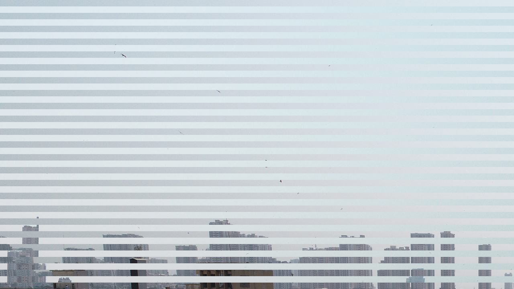
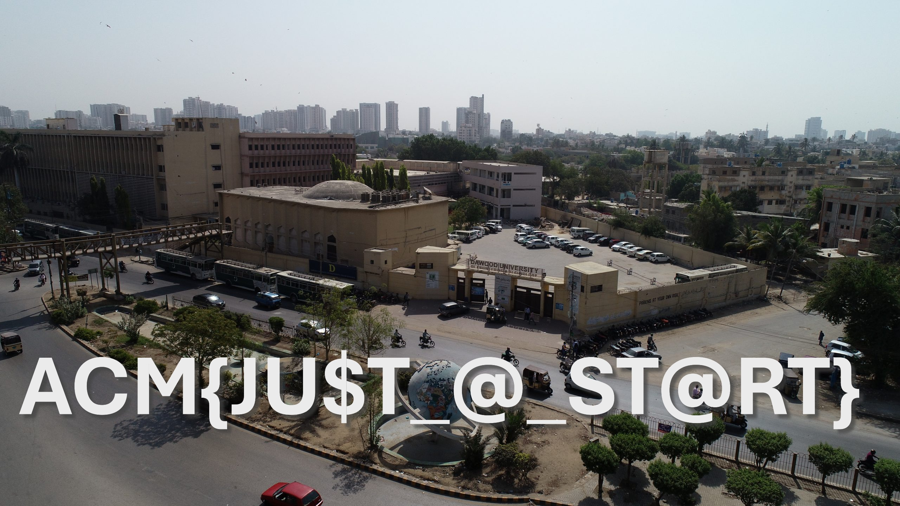

# 🌀 Perspective Shift

**Author:** Rabia Ishtiaq
**Level:** Medium
**Category:** Steganography
**Flag:** `ACM{JU$T_@_ST@RT}`

---

## 📜 Description

> *"Sometimes, it's better to take a step back."*

In this challenge, things may not be as they seem at first glance. Pay attention to the details, analyze the data carefully, and think creatively. The key could be hidden in plain sight—or maybe a simple adjustment will reveal what you're looking for.
Sometimes, **scaling down leads to seeing more**.

---

## 🧠 Challenge Overview

Players were given an image file that appeared completely **normal or broken** when opened. However, those who investigated deeper noticed something unusual about the file structure—specifically, the **magic bits** of the image header.

### 🕵️‍♀️ The Twist?

The original image was a **2K resolution JPG**, but the **header was manipulated**, altering its resolution metadata and affecting how the image rendered.

---

## 🔬 Technical Breakdown

JPG images use **Start of Frame (SOF)** segments to define the image dimensions. The key bytes look like this:

```
FF C0 00 11 08 [height bytes] [width bytes]
```

### 🔧 Original Magic Bits (2K resolution):

```
FF C0 00 11 08 05 A0 0A 00
```

* `08` = bits per sample
* `05 A0` = 1440 (height)
* `0A 00` = 2560 (width)

### 🔁 Manipulated Version:

```
FF C0 00 11 08 02 D0 05 00
```

* `02 D0` = 720 (height)
* `05 00` = 1280 (width)

---

## 🧩 Solution

1. **Open the JPG in a hex editor** (like HxD).
2. **Navigate to the SOF0 segment** (starting with `FF C0`).
3. **Restore the correct magic bits** for 2K resolution:

   ```diff
   - FF C0 00 11 08 02 D0 05 00
   + FF C0 00 11 08 05 A0 0A 00
   ```
4. Save the file and open it in any image viewer.
5. The full-resolution image now displays—and the **flag** appears!

---

## 🖼️ Screenshots

### 🔎 Before Fixing the Magic Bits


*Figure 1: Image with altered resolution—flag is not visible.*

### ✅ After Restoring 2K Resolution


*Figure 2: Image restored to 2K resolution—flag becomes visible.*

---

## 🏁 Flag

```
ACM{JU$T_@_ST@RT}
```

---
