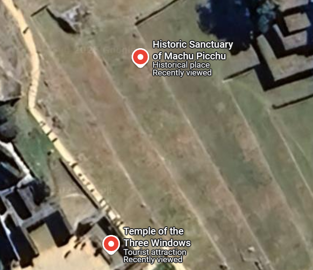

# 🕵️‍♀️ The Forgotten Triad — OSINT Challenge Write-Up

**Category:** OSINT | **Difficulty:** Easy
**Author:** Rabia Ishtiaq

---

## 🧩 Challenge Description:

> "Hidden high where the gods can see, I whisper through empty eyes.
> My builders never carved their words, but their walls speak in silence.
> A refuge above the clouds, untouched by the enemy’s greed.
> One man’s journey in 1911 rewrote my fate, but was I truly his to find?
> Count my openings, and you shall see the forgotten passage of time."
>
> Can you name this place???
> Sometimes, you are closer than you think.

---

## 🔍 Initial Thoughts

At first glance, the riddle-style prompt instantly suggested a location tied to:

* **Ancient architecture**
* **High-altitude structures**
* **Unwritten stories ("walls speak in silence")**
* **A historical discovery in 1911**

Many CTF participants were quick to guess **Machu Picchu**, and understandably so. After all, Hiram Bingham’s famous “discovery” of Machu Picchu in **1911** aligns closely with the clue.

But the trick was in the **details** — and more importantly, the **title**.

---

## 🧠 Hidden in Plain Sight

**Challenge Title:** *The Forgotten Triad*
This wasn’t just poetic flair — it was a direct **OSINT clue**. The word **“Triad”** subtly hinted at the number **three**.

When paired with this line from the riddle:

> *"Count my openings, and you shall see the forgotten passage of time."*

It nudges the reader toward something specific with **three "openings"** — possibly **windows**?

Also, the final line:

> *“Sometimes, you are closer than you think”*

This line was critical. For players who had already arrived at **Machu Picchu**, they were geographically in the right spot — but needed to **zoom in**.

---

## 🗺️ OSINT Sleuthing

A quick search around **Machu Picchu** with terms like:

```
“three windows in Machu Picchu”
“triad structure Peru”
“temple with three windows in Inca ruins”
```

Quickly leads to references of the **Temple of the Three Windows**, a **sacred structure within Machu Picchu**.




From an OSINT perspective, this required:

* Geographical context
* Cultural/historical trivia
* Close attention to challenge semantics and metaphors

---

## ✅ The Flag

After aligning all the dots, the correct answer was:

```
ACM{TEMPLE_OF_THE_THREE_WINDOWS}
```

---

## Key Takeaways

* This challenge rewarded **precision in detail** and **curiosity beyond the obvious**.
* Many were close by guessing Machu Picchu, but **the answer was literally within it**.
* The name “Forgotten Triad” and hints like **“count my openings”** were not filler—they were OSINT anchors.
* A quick visual sweep of Google Maps with a careful eye could have helped spot the **Temple of the Three Windows**.

---

## Final Thoughts

This OSINT challenge was a great reminder that:

> Sometimes, the answer isn’t wrong — it’s just **not complete**.

Players were in the right place — they just had to look a little **closer**.
